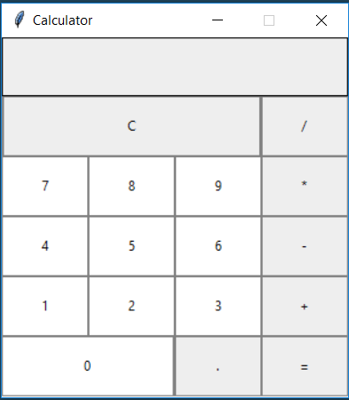

# What is GUI Programming

The graphical user interface (GUI /ˈɡuːi/) is a form of user interface that allows users to interact with electronic devices through graphical icons and visual indicators such as [secondary notation](https://en.wikipedia.org/wiki/Secondary_notation), instead of text-based user interfaces, typed command labels or text navigation. GUIs were introduced in reaction to the perceived steep learning curve of command-line interfaces (CLIs), which require commands to be typed on a computer keyboard.

Source [Wikipedia](https://en.wikipedia.org/wiki/Graphical_user_interface)

# What is TkInter?

[TkInter](https://wiki.python.org/moin/TkInter) is a Python package for GUI (Graphical User Interface) development. It is a thin, object-orientated, layer on top of [Tcl/Tk](http://www.tcl.tk/)

TkInter is not the only GUI package for Python, but it is one of the widely used ones. Full list [here](https://wiki.python.org/moin/GuiProgramming) or short list [here](https://wiki.python.org/moin/GUI%20Programming%20in%20Python).

It comes pre-installed with your Python 3 distribution. You just need to import it.

## Tcl/Tk Background

Tcl (Tool Command Language) is a very powerful but easy to learn dynamic, high-level, interpreted programming language, suitable for a very wide range of uses, including web and desktop applications, networking, administration, testing and many more. Open source and business-friendly, Tcl is a mature yet evolving language that is truly cross platform, easily deployed and highly extensible.

Tk is free and open-sourced graphical user interface toolkit that takes developing desktop applications to a higher level than conventional approaches. Tk is the standard GUI not only for Tcl, but for many other dynamic languages, and can produce rich, native applications that run unchanged across Windows, Mac OS X, Linux and more.

# Hello, TkInter!

Writing "Hello, World" in TkInter:

[hello_tkinter.py](examples/hello_tkinter.py):

```python
import tkinter as tk                          # 1

root = tk.Tk()                                # 2
my_label = Label(root, text="Hello, World!")  # 3
my_label.pack()                               # 4

root.mainloop()                               # 5
```

To run the program, execute it in your terminal, as usual:

`$ python hello_tkinter.py`

## So what is going on in our program?

1. We start by importing the `tkinter` module. We use `import-as` schema to allocate a friendly shortcut to our package;
2. Next we instantiate our main (root) window with the help of the Tk() class. This is an ordinary window, with a title bar and other characteristic decoration; You should only create one such window, and do it in the beginning of your program.
3. Now, we create a Label, which is able to display text and bitmaps. We assign it to our window, and use its `text` option, to pass in the text we want to be displayed;
4. By calling `.pack()` method,we are telling the Label to size itself to fit the given text, and make itself visible.
5. Finally, we start the `.mainloop()` of our window, so that everything is tight together, and displayed on the screen. The program will stay in the event loop until we close the window, meaning that it will handle not only events from user (mouse clicks and keys pressed), but also events from the windowing system (redrawing) and operations queued by Tkinter itself.

# The 4 basic GUI Programming tasks

When you develop a user interface (UI) there is a standard set of tasks you must accomplish:

* you must specify how you want the UI to **look**. That is, you must write code that determines what the user will see on the computer screen.
* you must decide what you want the UI to **do**. That is, you must write routines that accomplish the tasks of the program.
* You must associate the **looking** and **doing**. That is, you must write code that associates the things that the user sees on the screen with the routines that you have written to perform the program's tasks.
* Finally, you must write code that sits and waits for input from the user.

# GUI Jargon

GUI programming has some special jargon associated with these basic tasks.

1. We specify how we want a GUI to look by describing the *widgets* that we want it to display, and their spacial relationships (i.e. whether one widget is above or below, or to the right or left, of other widgets). The word *widget* is a nonsense word that has become the common term for *graphical user interface component*. Widgets include things such as windows, buttons, menus and menu items, icons,
drop-down lists, scroll bars, and so on.

2. The routines that actually do the work of the GUI are called *callback handlers* or *event handlers*.
*Events* are input events such as mouse clicks or presses of a key on the keyboard. These routines are called *handlers* because they *handle* (that is, respond to) such events.

3. Associating an event handler with a widget is called *binding*. Roughly, the process of binding involves associating three different things:
    * a type of event (e.g. a click of the left mouse button, or a press of the ENTER key on the keyboard)
    * a widget (e.g. a button), and
    * an event-handler routine.

    For example, we might bind a single-click of the left mouse button (*the event*) on the "CLOSE" button/widget
on the screen (*the widget*) to the "closeProgram" routine, which closes the window and shuts down the program (*the event-handler*).

4. The code that sits and waits for input is called the "event loop".

# Three concepts of Tkinter programming

* Creating a GUI object and associating it with its parent
* Packing
* Containers vs. Widgets

From now on, we are going to distinguish a container component from a widget. As we will be using
the terms, a *widget* is a GUI component that (usually) is visible and does things. A *container* in
contrast is simply a container -- a basket, as it were -- into which we can put widgets.

Tkinter provides a number of containers. **Canvas** is a container for drawing applications. The most
frequently used container is a **frame**.
Frames are provided by Tkinter in a class called `Frame`. An expression like:

```python
Frame(myParent)
```

creates an instance of the *Frame* class (that is, it creates a frame), and associates the frame instance
with its parent, *myParent*.  

Or another way of looking at it is:  

* such an expression adds a child frame to
the myParent component.

Given the following code, [frame_example.py](examples/frame_example.py):

```python
from tkinter import *

root = Tk()

myContainer1 = Frame(root) # (1)
myContainer1.pack()        # (2)

root.mainloop()
```

**Line (1)** creates a frame whose parent is **root**, and gives it the name "myContainer1". In
short, it creates a container into which we can put widgets.  

> Note that the parent/child relationship here is a **LOGICAL** one, not a visual one. This relationship exists to support such things as the destroy event -- so that when a parent component (such as the root) is
destroyed, the parent knows who its children are, and can destroy them before destroying itself.

**Line (2)** we are "packing". This is the process of setting up a **VISUAL** relationship between a GUI component and its parent. If you don't pack a component, you will never see it.

*Pack* invokes the Tkinter `pack` geometry manager. A geometry manager is essentially an API -- a
way of talking to Tkinter -- for telling Tkinter how you want containers and widgets to be visually
presented. Tkinter supports three geometry managers: `pack`, `grid`, and `place`. **Pack** and, to a lesser
extent, **grid** are the most widely used, because they are the easiest to use.

> This is a basic pattern for Tkinter programming, that we will see over and over again:
>1. an instance (of a widget or a container) is created, and associated with its parent;
>2. the instance is packed

**Frames Are Elastic**

A frame is basically a container. The interior of a container -- the "space" as it were, inside the
container -- is called the "cavity". ("Cavity" is a technical term that Tkinter gets from Tk.)
This cavity is "stretchy" or elastic, like a rubber band. Unless you specify a minimum or a maximum size
for the frame, the cavity will stretch or shrink to accommodate whatever is placed inside the frame.

Because we have put something into the root's cavity -- we have put Container1 into it, the root frame shrinks to accommodate the size of Container1, compared to a program without a container, i.e., this [basic_example.py](examples/basic_example.py):

```python
import tkinter as tk

root = tk.Tk()

tk.mainloop()
```

 But since we haven't put any widgets into Container1, and we haven't specified a minimum size for Container1, the root's cavity shrinks down to nothing. That is why there is nothing to see below the title bar.

In the next few programs, we will put widgets and other containers into Container1, and you will see
how Container1 stretches to accommodate them.

Now let's add our first widget (building on existing code), and see how *myContainer1* stretches to accommodate a  button, in [frame_button_example.py](examples/frame_button_example.py):

```python
import tkinter as tk

root = tk.Tk()

myContainer1 = tk.Frame(root)      # (1)
myContainer1.pack()                # (2)

# new code
button1 = tk.Button(myContainer1)  # (3)
button1["text"]= "Hello, World!"   # (4)
button1["background"] = "green"    # (5)
button1.pack()                     # (6)
#

root.mainloop()
```

**Line (3)** instantiates a button, gives it the name "button1", and associates it with its parent, the container object called myContainer1.

**Lines (4)(5)** widgets have many attributes, which are stored in their local namespace dictionary. Button widgets have attributes to control their size, their foreground and background colors, the text that they display, how their borders look, and so on. In this example, we will set just two of button1's attributes:

* the background color, and
* the text.

We do it by setting the values in the button's dictionary with the keys *text* and *background*.

**Line (6)** and of course, we pack button1.

> Note how myContainer1 has stretched to accommodate button1.

# Widgets

Let's have a closer look on some of the most important widgets for GUI Programming.

Before going further, we will also introduce a new module, called `ttk`, which comes with Tkinter.
`ttk` stands for *themed tk*, and provides access to the Tk themed widget set, introduced in Tk 8.5.

The basic idea for `tkinter.ttk` is to separate, to the extent possible, the code implementing a widget’s behavior from the code implementing its appearance.

We access it by importing as follows:

```python
from tkinter import ttk
```

> For a more detailed description of `ttk`, please see [Addendum - ttk](#ttk)

## Label

A label is a widget that allows you to display text of images (bitmaps).

```python
import tkinter as tk

root = tk.Tk()

my_label = tk.Label(root, text="My Label")
my_label.pack()

root.mainloop()
```

Source code [here](examples/label_example).

## Button

A button can have a label (not the same as the widget above), to convey what the button is doing, and an action attached to it.

```python
import tkinter as tk

root = tk.Tk()

my_label = tk.Label(root, text="My Label")
my_label.pack()

# defining the callback (event) handler for the button
def click_me():
    action.configure(text="** I have been clicked **")
    my_label.configure(foreground='red')

# adding a button
action = tk.Button(root, text="Click ME!", command=click_me)
action.pack()

root.mainloop()
```

Source code [here](examples/button_example.py).

## Text box

A typical textbox is called **Entry**.  
Python is a dynamically-typed language and infers the type from the assignment. What this means is if we assign a string to the variable name, the variable will be of the type string, and if we assign an integer to name, this variable's type will be integer.  
Using tkinter, we have to declare the variable name as the type `tk.StringVar()` before we can use it successfully. The reason is this that Tkinter is not Python. We can use it from Python but it is not the same language.

```python
import tkinter as tk

root = tk.Tk()

# create a variable that will be bound to the Entry
name = tk.StringVar()
# create the Entry widget. We can use the width property to give 
# it a fixed size
name_entered = tk.Entry(root, width=12, textvariable=name)
name_entered.pack()

root.mainloop()
```

Source code [here](examples/text_box_example.py).

## Combo box (dropdown list)

This widget is specific to `ttk`.

```python
import tkinter as tk
from tkinter import ttk

root = tk.Tk()

# we need a variable to store the value from the combobox
number = tk.StringVar()
number_chosen = ttk.Combobox(root, textvariable=number)
# we assign a tuple with default values, which will appear in the drop-down list
number_chosen['values'] = (1, 2, 4, 14, 100)
# we assign the default value based on the index of our list
number_chosen.current(0)

number_chosen.pack()

root.mainloop()
```

Source code [here](examples/combo_box_example.py).

> Inside the Combobox, you can select any given value, but you can also type your own. If you want to restrict this behaviour, you can use `state='readonly'` property.  

As an alternative, we have the Listbox from tkinter.

```python
import tkinter as tk

root = tk.Tk()

my_listbox = tk.Listbox(root)
for item in ["one", "two", "three", "four"]:
    my_listbox.insert(tk.END, "Choice " + item)
my_listbox.pack()

root.mainloop()
```

Source code [here](examples/listbox_example.py).


## Check button

```python
import tkinter as tk

root = tk.Tk()

# creating a disabled check button

# assigning a variable. This will hold the state of the button
# the states are represented by 0 (unchecked) and 1 (checked)
check_button_disabled = tk.IntVar()
check_button_1 = tk.Checkbutton(root, text="Disabled", variable=check_button_disabled, state="disabled")
# pre-selecting it
check_button_1.select()
check_button_1.pack()

# creating an unchecked button

check_button_unchecked = tk.IntVar()
check_button_2 = tk.Checkbutton(root, text="UnChecked", variable=check_button_unchecked)
# un-checking the button (this is the default state)
check_button_2.deselect()
check_button_2.pack()

# creating a pre-checked button

check_button_checked = tk.IntVar()
check_button_3 = tk.Checkbutton(root, text="Checked", variable=check_button_checked)
# pre-selecting it
check_button_3.select()
check_button_3.pack()

root.mainloop()
```

Source code [here](examples/check_button_example.py).

## Radio button

```python
import tkinter as tk

root = tk.Tk()

# defining some global variables
# the values assigned, are tkinter keywords for colors
COLOR1 = "Red"
COLOR2 = "Blue"

# defining radio button callback
def radioCall():
    radio_select = radio_variable.get()
    if   radio_select == 1: root.configure(background=COLOR1)
    elif radio_select == 2: root.configure(background=COLOR2)

# creating a variable to store the values of the radio buttons
# we use a common one, so that it is easier to use it in our callback
radio_variable = tk.IntVar()
radio_1 = tk.Radiobutton(root, text=COLOR1, variable=radio_variable, value=1, command=radioCall)
radio_1.pack()

radio_2 = tk.Radiobutton(root, text=COLOR2, variable=radio_variable, value=2, command=radioCall)
radio_2.pack()

root.mainloop()
```

Source code [here](examples/radio_button_example.py).

> See [here](https://www.tcl.tk/man/tcl8.4/TkCmd/colors.htm) for a complete list of `color` keywords in tk.

# Layout management

In order to make our applications stand out, we need to take full control on how they look.  
To doing so, we can take advantage of the layout management tools that tkinter provides. We briefly mentioned that we have 3 layout managers:
* grid,
* pack, and
* place

Now we will take a closer look on `grid`.

## Arranging several labels within a label frame widget

```python
import tkinter as tk
from tkinter import ttk

root = tk.Tk()

# we create a basic label and pin it to the grid based on x,y coordinates
tk.Label(root, text="label on root").grid(column=0, row=7)

# we create a basic Frame and pin it to the root
tk_frame = tk.Frame(root)
tk_frame.grid(column=1, row=8)

# we create 3 basic labels, and pin them in an horizontal fashion inside the tk_frame
tk.Label(tk_frame, text="label_1").grid(column=0, row=0)
tk.Label(tk_frame, text="label_2").grid(column=1, row=0)
tk.Label(tk_frame, text="label_3").grid(column=2, row=0)

# we create a ttk Frame (it can have a title) and pin it to the root
ttk_frame = ttk.LabelFrame(root, text="My Label Frame")
ttk_frame.grid(column=1, row=9)

# we create 3 more basic Labels, and pin them in a vertical fashion inside the ttk_frame
tk.Label(ttk_frame, text="label_1").grid(column=0, row=0)
tk.Label(ttk_frame, text="label_2").grid(column=0, row=1)
tk.Label(ttk_frame, text="label_3").grid(column=0, row=2)

root.mainloop()
```

Source code [here](examples/label_frame_example.py)

## Using padding to add space around widgets

To improve our GUI, we can add a little more space around our widgets. It is done simply by coding the `padx` and `pady` properties inside the `grid()` method.

```python
import tkinter as tk
from tkinter import ttk

root = tk.Tk()

# we create a basic label and pin it to the grid based on x,y coordinates
tk.Label(root, text="label on root").grid(column=0, row=7)

# we create a basic Frame and pin it to the root
tk_frame = tk.Frame(root)
tk_frame.grid(column=1, row=8)

# we create 3 basic labels, and pin them in an horizontal fashion inside the tk_frame
tk.Label(tk_frame, text="label_1").grid(column=0, row=0)
tk.Label(tk_frame, text="label_2").grid(column=1, row=0)
tk.Label(tk_frame, text="label_3").grid(column=2, row=0)

tk.Label(tk_frame, text="label_11").grid(column=0, row=1, padx=20, pady=40)
tk.Label(tk_frame, text="label_22").grid(column=1, row=1, padx=20, pady=40)
tk.Label(tk_frame, text="label_33").grid(column=2, row=1, padx=20, pady=40)

# we create a ttk Frame (it can have a title) and pin it to the root
ttk_frame = ttk.LabelFrame(root, text="My Label Frame")
ttk_frame.grid(column=1, row=9)

# we create 3 more basic Labels, and pin them in a vertical fashion inside the ttk_frame
tk.Label(ttk_frame, text="label_1").grid(column=0, row=0)
tk.Label(ttk_frame, text="label_2").grid(column=0, row=1)
tk.Label(ttk_frame, text="label_3").grid(column=0, row=2)

root.mainloop()
```

Source code [here](examples/padding_example.py)

> All Frames have a method `.winfo_children()` which will return a list of all widgets pinned to it. This way, you can programmatically update all of them. For example, with *widget*`.grid_configure(padx=10, pady=20)`.


## Creating a menu bar

To be able to create a menu bar, we first need to `import` the `Menu` class from tkinter.

```python
import tkinter as tk
from tkinter import Menu

root = tk.Tk()

# creating the callback for the File->Exit menu command
def _quit():
    root.quit()     # quits the tcl interpreter
    root.destroy()  # destroy this and all descendants widgets
    exit()          # exit python interpreter


# creating the menu_bar object
menu_bar = Menu(root)
root.config(menu=menu_bar)

# now we add a menu to the bar and also assign some menu items to the menu

# creating the menu object
# `tearoff` property eliminates the dotted line that is added by default
file_menu = Menu(menu_bar, tearoff=0)
file_menu.add_command(label="New")                 # adding "New" command
file_menu.add_separator()                          # adding a separator
file_menu.add_command(label="Exit", command=_quit) # adding "Exit" command
# inserting the file_menu menu, into a label File, attached to the menu_bar
menu_bar.add_cascade(label="File", menu=file_menu)

# adding the Help-About menu
help_menu = Menu(menu_bar, tearoff=0)
help_menu.add_command(label="About")
menu_bar.add_cascade(label="Help", menu=help_menu)


root.mainloop()
```

Source code [here](examples/menu_bar_example.py)

## Creating a message box (information, warning, error)

We will build on the previous example, and add some information regarding our GUI, in the Help->About menu.  
In order to do that, we need to import yet another feature of tkinter.

```python
import tkinter as tk
from tkinter import Menu
from tkinter import messagebox as mBox   # importing messagebox

root = tk.Tk()
root.title("My Python GUI APP")

def _quit():
    root.quit()
    root.destroy()  
    exit()

# defining the callback for the "About" command
def _about():
    mBox.showinfo("About 'My Python GUI APP'","This is our Python GUI APP,\ncreated with tkinter.\n\nVersion 1.0.0")
menu_bar = Menu(root)
root.config(menu=menu_bar)

file_menu = Menu(menu_bar, tearoff=0)
file_menu.add_command(label="New")
file_menu.add_separator()
file_menu.add_command(label="Exit", command=_quit)
menu_bar.add_cascade(label="File", menu=file_menu)

help_menu = Menu(menu_bar, tearoff=0)
# linking the callback to the command
help_menu.add_command(label="About", command=_about)
menu_bar.add_cascade(label="Help", menu=help_menu)


root.mainloop()
```

Source code [here](examples/message_box_example.py)

# Miscellaneous 

## Set focus to a widget:

```python
import tkinter as tk

root = tk.Tk()

my_button = tk.Button(root, text="My button")
# use the focus() method for respective widgets
my_button.focus()
my_button.pack()

root.mainloop()
```

## Disable a widget:

```python
import tkinter as tk

root = tk.Tk()

my_button = tk.Button(root, text="My button")
# use the configure() method for respective widget to change the 'state' property
my_button.configure(state="disabled")
my_button.pack()

root.mainloop()
```

## Preventing a GUI from being resized:

```python
import tkinter as tk

root = tk.Tk()
# disable resizing the GUI
root.resizable(0,0)

root.mainloop()
```

## Adding a title to the window

```python
import tkinter as tk

root = tk.Tk()
root.title("My Python GUI App")

root.mainloop()
```

## Change the icon of the main root window

```python
import tkinter as tk

root = tk.Tk()

root.iconbitmap(r"path\to\icon_file.ico")

root.mainloop()
```

# Your challange!

Create your own calculator.



See our implementation [here](exercise/calculator_v1.py) and [here](exercise/calculator_v2.py).
---

# Addendum

## ttk
Starting with Tk 8.5, the ttk module became available. This module replaces much (but not all) of the original Tkinter machinery. Use this module to gain these advantages:

* *Platform-specific appearance*. In releases before Tk 8.5, one of the commonest complaints about Tk applications was that they did not conform to the style of the various platforms.

The ttk module allows you to write your application in a generic way, yet your application can look like a Windows application under Windows, like a MacOS app under MacOS, and so on, without any change to your program.

Each possible different appearance is represented by a named ttk theme. For example, the classic theme gives you the appearance of the original Tkinter widgets described in the previous sections.

* *Simplification and generalization of state-specific widget behavior*. In the basic Tkinter world, there are a lot of widget options that specify how the widget should look or behave depending on various conditions.

For example, the tk.Button widget has several different options that control the foreground (text) color:

* The *activeforeground* color option applies when the cursor is over the button.

* The *disabledforeground* color is used when the widget is disabled.

* The widget will have the foreground color when the other conditions don't apply.

The ttk module collapses a lot of these special cases into a simple two-part system:

* Every widget has a number of different states, and each state can be turned on or off independently of the others. Examples of states are: *disabled*, *active*, and *focus*.

* You can set up a style map that specifies that certain options will be set to certain values depending on some state or some combination of the widget's states.

[Documentation](http://infohost.nmt.edu/tcc/help/pubs/tkinter/web/ttk-widget-set.html) for widgets from ttk.
---

# Bookstore app

Find the bookstore app [here](examples/bookstore_app).